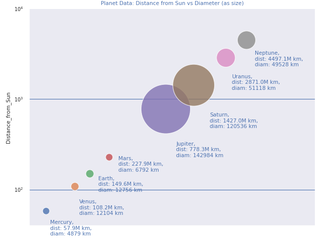

# planets

This python script creates a scatter plot of planets.

View the code in [planets.py](planets.py) 

It uses the following libraries:
* matplotlib
* numpy
* pyplot
* pandas
* seaborn.

A static array of planet data:
* Planet Name
* Distance from Sun
* Diameter
* x coord
* y coord

It then adds the data to a pandas dataframe and uses the scatterplot() seaborn function to create a plot of the planets with relevent distances from the sun and diameters.

The plot is saved as scatterplot.png

